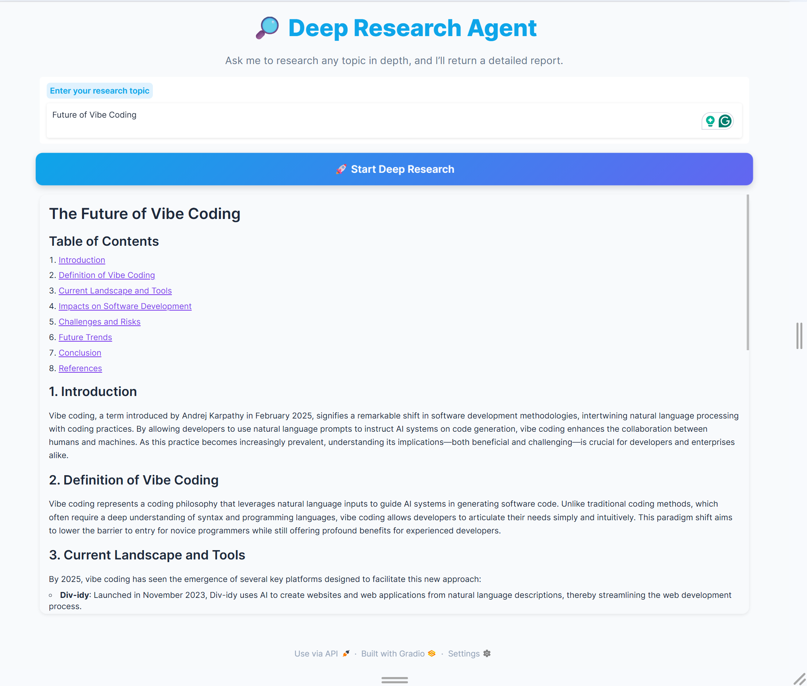

# 🔎 Deep Research Agent

A modern, async **multi‑agent** research system with a **stunning Gradio UI**.  
It plans searches, runs them in parallel, synthesizes findings into a clean report, and emails the result — all with tracing and streaming status updates.



---

## ✨ Highlights

- **Multi‑agent pipeline**: `planner_agent` → `search_agent`(s, in parallel) → `writer_agent` → `email_agent`
- **Async & streaming**: non‑blocking UI updates via an async generator (`yield` chunks)
- **Parallel web search**: `asyncio.create_task()` + `asyncio.as_completed()`
- **Deterministic outputs**: pydantic models (`WebSearchPlan`, `WebSearchItem`, `ReportData`)
- **Observability**: trace id + link to OpenAI Traces
- **Beautiful, responsive UI**: polished Gradio layout with subtle animations

---

## 🧠 Architecture

```mermaid
flowchart LR
    A[User query] --> B[planner_agent]
    B -->|WebSearchPlan (N items)| C{async parallel}
    C --> D1[search_agent #1]
    C --> D2[search_agent #2]
    C --> Dn[search_agent #N]
    D1 & D2 & Dn --> E[writer_agent]
    E --> F[email_agent]
    F --> G[Markdown Report + Email Sent]
```

**Execution flow (from `ResearchManager.run`)**

1. Generate `trace_id` and emit a trace URL
2. `plan_searches(query)` → returns `WebSearchPlan` (list of `WebSearchItem`)
3. `perform_searches(plan)` → fire all searches **in parallel**; stream progress
4. `write_report(query, results)` → produce `ReportData` with `markdown_report`
5. `send_email(report)` → deliver via Resend
6. Stream final markdown back to the UI

---

## 📦 Key Files

```
.
├── app.py                # Gradio UI (responsive, animated button)
├── research_manager.py   # Orchestrates the multi-agent pipeline (async + streaming)
├── my_agents.py          # (Your) shared types like WebSearchItem, WebSearchPlan, ReportData
├── agents.py             # Agent, Runner, trace, gen_trace_id, tools (WebSearchTool)
├── README.md             # This file
└── requirements.txt      # Python deps (create as needed)
```

---

## 🔩 Core Orchestrator (`research_manager.py`)

**Highlights**

- Uses an **async generator** to `yield` status messages and the final markdown.
- Plans searches, runs them concurrently, then formats and emails the report.
- Demonstrates **fault-tolerant** search (returns `None` on failure; filters later).

```python
# research_manager.py (excerpt)
class ResearchManager:
    async def run(self, query: str):
        trace_id = gen_trace_id()
        with trace("Research trace", trace_id=trace_id):
            print(f"View trace: https://platform.openai.com/traces/trace?trace_id={trace_id}")
            yield f"View trace: https://platform.openai.com/traces/trace?trace_id={trace_id}"
            print("Starting research...")
            search_plan = await self.plan_searches(query)
            yield "Searches planned, starting to search..."
            search_results = await self.perform_searches(search_plan)
            yield "Searches complete, writing report..."
            report = await self.write_report(query, search_results)
            yield "Report written, sending email..."
            await self.send_email(report)
            yield "Email sent, research complete"
            yield report.markdown_report
```

**Concurrency details**

- `perform_searches` uses `asyncio.create_task` to launch each search.
- `asyncio.as_completed` streams results in the order they finish (not the planned order) which gives **progressive updates**.

```python
# research_manager.py (excerpt)
async def perform_searches(self, search_plan: WebSearchPlan) -> list[str]:
    num_completed = 0
    tasks = [asyncio.create_task(self.search(item)) for item in search_plan.searches]
    results = []
    for task in asyncio.as_completed(tasks):
        result = await task
        if result is not None:
            results.append(result)
        num_completed += 1
        print(f"Searching... {num_completed}/{len(tasks)} completed")
    return results
```

---

## 🤖 Agents

### `search_agent`

Purpose: Execute web searches and return a **concise 2–3 paragraph** summary (< 300 words) without extra commentary.

```python
from agents import Agent, WebSearchTool, ModelSettings

INSTRUCTIONS = (
    "You are a research assistant. Given a search term, you search the web for that term and "
    "produce a concise summary of the results. The summary must 2-3 paragraphs and less than 300 "
    "words. Capture the main points. Write succintly, no need to have complete sentences or good "
    "grammar. This will be consumed by someone synthesizing a report, so its vital you capture the "
    "essence and ignore any fluff. Do not include any additional commentary other than the summary itself."
)

search_agent = Agent(
    name=\"Search agent\",
    instructions=INSTRUCTIONS,
    tools=[WebSearchTool(search_context_size=\"low\")],
    model=\"gpt-4o-mini\",
    model_settings=ModelSettings(tool_choice=\"required\"),
)
```

Notes:

- `tool_choice="required"` forces the model to **use the web search tool**.
- `search_context_size="low"` reduces token usage; consider `"medium"` or `"high"` for broader context.

### `planner_agent`

Purpose: Produce a **fixed number** of high-signal search terms.

```python
from pydantic import BaseModel, Field
from agents import Agent

HOW_MANY_SEARCHES = 2

INSTRUCTIONS = f"You are a helpful research assistant. Given a query, come up with a set of web searches \
to perform to best answer the query. Output {HOW_MANY_SEARCHES} terms to query for."

class WebSearchItem(BaseModel):
    reason: str = Field(description="Your reasoning for why this search is important to the query.")
    query: str = Field(description="The search term to use for the web search.")

class WebSearchPlan(BaseModel):
    searches: list[WebSearchItem] = Field(description="A list of web searches to perform to best answer the query.")

planner_agent = Agent(
    name=\"PlannerAgent\",
    instructions=INSTRUCTIONS,
    model=\"gpt-4o-mini\",
    output_type=WebSearchPlan,
)
```

Tips:

- Tune `HOW_MANY_SEARCHES` based on latency/cost vs coverage.
- You can add constraints (e.g., require diverse sources or time-scoped queries).

### `writer_agent` & `email_agent`

- `writer_agent` should **accept** `Original query` + summarized search snippets and output a `ReportData` model with a `markdown_report: str`.
- `email_agent` should accept the markdown and send via Resend, returning a confirmation (or raising on failure).

**Expected type** (example):

```python
# my_agents.py (sketch)
from pydantic import BaseModel

class ReportData(BaseModel):
    title: str
    markdown_report: str  # final report shown in UI and emailed
```

---

## 🎛️ Gradio UI (modern, responsive, animated)

The UI streams the async generator output and shows status + final markdown.  
It uses a **centered layout, gradient button, and subtle pulse animation**.

```python
# app.py
import gradio as gr
from dotenv import load_dotenv
from research_manager import ResearchManager

load_dotenv(override=True)

async def run(query: str):
    async for chunk in ResearchManager().run(query):
        yield chunk

with gr.Blocks(
    theme=gr.themes.Soft(
        primary_hue=\"sky\",
        secondary_hue=\"violet\",
        neutral_hue=\"slate\",
        font=[\"Inter\", \"sans-serif\"],
    ),
    css=\"\"\"
    #app-title { text-align:center; font-size:2....
    \"\"\"
) as ui:
    gr.Markdown(\"<div id='app-title'>🔎 Deep Research Agent</div>\")
    gr.Markdown(\"<div id='app-subtitle'>Ask me to research any topic in depth, and I’ll return a detailed report.</div>\")
    ...

    run_button.click(fn=run, inputs=query_textbox, outputs=report)
    query_textbox.submit(fn=run, inputs=query_textbox, outputs=report)

ui.launch(inbrowser=True)
```

---

## ⚙️ Setup

### Requirements

- Python 3.13+
- API keys for OpenAI (and Resend, if emailing)

### Install

```bash
uv sync
```

Example `pyproject.toml`:

```
gradio>=4.44.0
python-dotenv>=1.0.1
pydantic>=2.5.0
anyio>=4.0.0
httpx>=0.27.0
```

_(Add your agent framework deps — e.g., OpenAI SDK or custom agents package.)_

### Environment

Add a `.env` file at the project root:

```
OPENAI_API_KEY=sk-...
RESEND_API_KEY=re_...
RESEND_FROM_EMAIL=reports@example.com
RESEND_TO_EMAIL=you@example.com
```

---

## ▶️ Run

```bash
uv run main.py
```

In the UI:

1. Enter a topic (e.g., “EU AI Act impact on startups 2025”).
2. Click **Start Deep Research**.
3. Watch statuses stream: planning → parallel search → writing → emailing → final report.

---

## 🧪 Tips & Customization

- **Increase coverage**: bump `HOW_MANY_SEARCHES` for broader results (higher latency/cost).
- **Search depth**: raise `search_context_size` to `"medium"` or `"high"` in `WebSearchTool`.
- **Ordering**: use `asyncio.gather` if you prefer deterministic result order (no progressive streaming).
- **Robustness**: add retries/backoff in `search()`; log failures with context.
- **Writer style**: enforce headings, citations, and TL;DR in `writer_agent` instructions.
- **Tracing**: the README’s trace link prints once per run for quick debugging.

---

## 🛠️ Troubleshooting

- **RuntimeError: cannot call async function from sync**  
  Ensure `asyncio.run(...)` is used in your entrypoint (see `app.py`).
- **Empty report / tool not called**  
  Verify `model_settings.tool_choice="required"` on `search_agent`.
- **Email not sent**  
  Check `.env` values and sender domain verification in Resend.
- **Rate limits / 429**  
  Add jittered retries and batch your searches.

---

## 🗺️ Roadmap

- Rich citations table with sources & confidence
- Configurable sources (news, academic, patents)
- Queue-based job runner for batch research
- Export to PDF/Notion

---

## 📜 License

MIT © 2025

---

> Questions or ideas? Open an issue or PR. Happy researching! ✨
